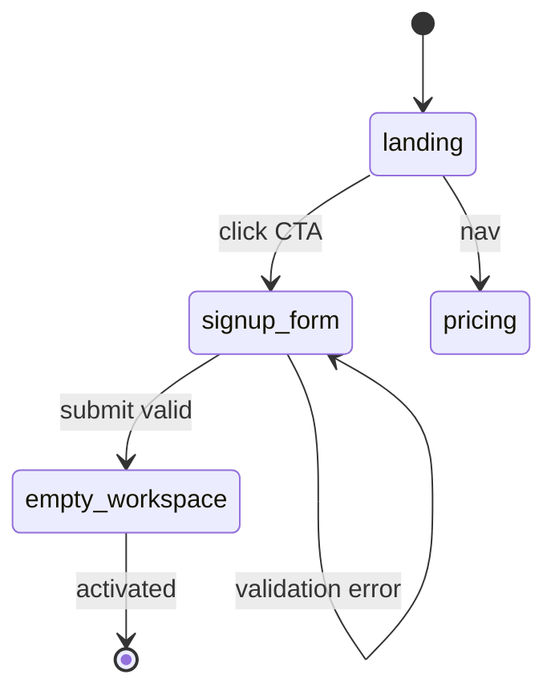

# UX Flow Mapper Skill

`ui-designer` covers a single screen. This skill covers the multi-screen flow between them. `funnel-analyzer` measures drop-offs; this skill names the screens being measured.

## Why this exists

`MattZerg/Projects/Zstack/Growth/journeys/` has hand-authored journey docs (zergboard-icp.md, solutions-buyer.md). Those are strong on persona narrative, inconsistent on screen-level detail. When Matt needs "what are all the screens in the signup flow and what state can they be in," there's no structured artifact.

This skill produces that structured artifact: Mermaid state diagram, screen inventory table, drop-off-candidate annotations. Pairs with `funnel-analyzer`. This skill names the steps. funnel-analyzer measures them.

## Modes

### `map` — read spec, emit structured journey

```bash
python3 ~/.claude/skills/ux-flow-mapper/run.py map \
  --spec ~/Desktop/signup-flow-spec.yaml \
  --output zergboard-signup
```

Spec YAML shape:

```yaml
---
flow: zergboard-signup
product: zergboard
persona: tech-lead-25-person-team
description: "From landing page → activated account"
ship_status: wip  # live | wip | planned
screens:
  - id: landing
    name: "Landing page"
    purpose: "Sell the value prop in 10s"
    primary_cta: "Sign up free"
    ship_status: live
    drop_off_severity: high  # tracked by funnel-analyzer signup funnel
    exits:
      - to: signup_form
        condition: "click CTA"
      - to: pricing
        condition: "click pricing nav"
  - id: signup_form
    name: "Signup form"
    purpose: "Capture email + workspace name"
    primary_cta: "Create workspace"
    ship_status: live
    drop_off_severity: high
    error_states:
      - email_invalid
      - workspace_taken
    exits:
      - to: empty_workspace
        condition: "submit valid"
  # ...
---
```

Outputs to `MattZerg/Projects/Zstack/Growth/journeys/<output>.md`:
- YAML frontmatter (flow metadata)
- Mermaid `stateDiagram-v2` block
- Screen inventory table (id / name / purpose / CTA / ship-status / drop-off severity)
- Error-state index
- Pair-with hints (which funnels measure which transitions; which experiments touch this flow)

### `audit` — drive playwright, capture observed flow

```bash
python3 ~/.claude/skills/ux-flow-mapper/run.py audit \
  --url http://localhost:3001/signup \
  --output zergboard-signup-observed \
  --screens-dir ~/Desktop/signup-screens/
```

Phase 1: requires `--screens-dir` to be pre-populated (from `fakematt-feedback` or manual capture). Walks the directory, infers screens from filenames + a screens-manifest.json, writes journey markdown.

Phase 2 (when wired): integrates `fakematt-feedback`'s playwright harness directly to capture screens + transitions automatically.

### `compare` — diff intended vs observed

```bash
python3 ~/.claude/skills/ux-flow-mapper/run.py compare \
  --intended journeys/zergboard-signup.md \
  --observed journeys/zergboard-signup-observed.md
```

Surfaces:
- Screens in spec but not observed (dead-letter / unreachable)
- Screens observed but not in spec (drift / unintended branches)
- Transitions skipped (path-of-least-resistance issues)
- State changes the audit captured that the spec didn't claim

## Output format (canonical journey markdown)

```markdown
---
flow: zergboard-signup
product: zergboard
persona: tech-lead-25-person-team
ship_status: wip
generated: 2026-05-07
generator: ux-flow-mapper
---

# Flow: <name>

## State diagram



## Screen inventory

| ID | Name | Purpose | Primary CTA | Ship | Drop-off |
|---|---|---|---|---|---|
| landing | Landing page | Sell value prop | Sign up free | live | high |
| signup_form | Signup form | Capture email | Create workspace | live | high |
| empty_workspace | Empty workspace | Land + activate | Create board | live | medium |

## Error states

- `signup_form`: email_invalid, workspace_taken

## Pair with

- **funnel-analyzer:** `signup` funnel measures landing → signup_form → empty_workspace
- **experiments:** exp-002 (signup-cta-copy), exp-003 (drip-subject)
- **cro-auditor:** run on `landing` after drop-off persists ≥7 days

## Notes

(Hand-edited journey-prose section — preserved on re-runs.)
```

## Anti-drift contract

- **`map` is idempotent** — re-running with the same spec produces byte-identical output (modulo `generated` date), so manual edits in the "Notes" section survive regeneration.
- **`audit` requires a screens manifest** with explicit URL → screen-id mapping. No silent inference from file names alone.
- **Drop-off severity values** are constrained to `low | medium | high` — matches `funnel-analyzer` friction-threshold buckets.
- **Ship-status values** are constrained to `live | wip | planned | deprecated` — matches the journeys/ folder convention.

## Routing to other skills

| Output | Suggested next |
|---|---|
| Drop-off severity = high on a screen | `cro-auditor` on that page, then `funnel-analyzer define` the transition |
| Screen marked `planned` | `ui-designer` to scaffold its design |
| `compare` finds dead-letter screens | `fakematt-feedback` audit on those screens |
| Error state with no recovery path | flag for `experiment-designer` (a recovery-path test) |

## Implementation notes

- Stdlib-only (Phase 1) — YAML parser is hand-rolled, no PyYAML dep
- File-based: spec in YAML/JSON, output in markdown
- Idempotent `map`: preserves user-authored "Notes" section across re-runs by extracting it before regeneration and re-appending
- `audit` Phase 1 = manifest-driven; Phase 2 = playwright-integrated
